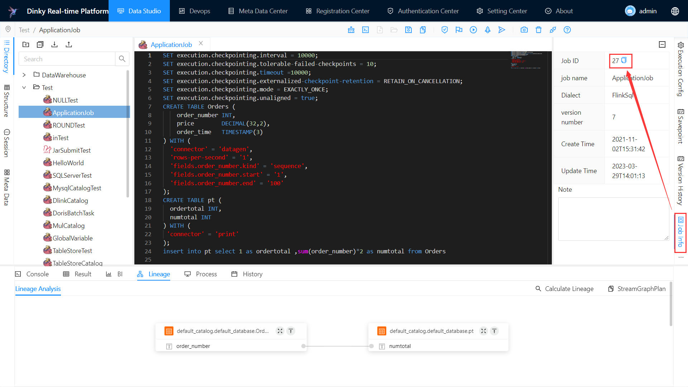

# Dinky

## Overview

Use `Dinky Task` to create a dinky-type task and support one-stop development, debugging, operation and maintenance of FlinkSql, Flink jar and SQL. When the worker executes `Dinky Task`,
it will call `Dinky API` to trigger dinky task. Click [here](http://www.dlink.top/) for details about `Dinky`.

## Create Task

- Click Project Management-Project Name-Workflow Definition, and click the "Create Workflow" button to enter the DAG editing page.
- Drag  from the toolbar to the canvas.

## Task Parameter

- Node name: The node name in a workflow definition is unique.
- Run flag: Identifies whether this node can be scheduled normally, if it does not need to be executed, you can turn on the prohibition switch.
- Descriptive information: Describe the function of the node.
- Task priority: When the number of worker threads is insufficient, execute in the order of priority from high to low, and tasks with the same priority will execute in a first-in first-out order.
- Worker grouping: Assign tasks to the machines of the worker group to execute. If `Default` is selected, randomly select a worker machine for execution.
- Number of failed retry attempts: The failure task resubmitting times. It supports drop-down and hand-filling.
- Failed retry interval: The time interval for resubmitting the task after a failed task. It supports drop-down and hand-filling.
- Timeout alarm: Check the timeout alarm and timeout failure. When the task exceeds the "timeout period", an alarm email will send and the task execution will fail.
- Dinky Address: The url for a dinky server.
- Dinky Task ID: The unique task id for a dinky task.
- Online Task: Specify whether the current dinky job is online. If yes, the submitted job can only be submitted successfully when it is published and there is no corresponding Flink job instance running.

## Task Example

### Dinky Task Example

This example illustrates how to create a dinky task node.

